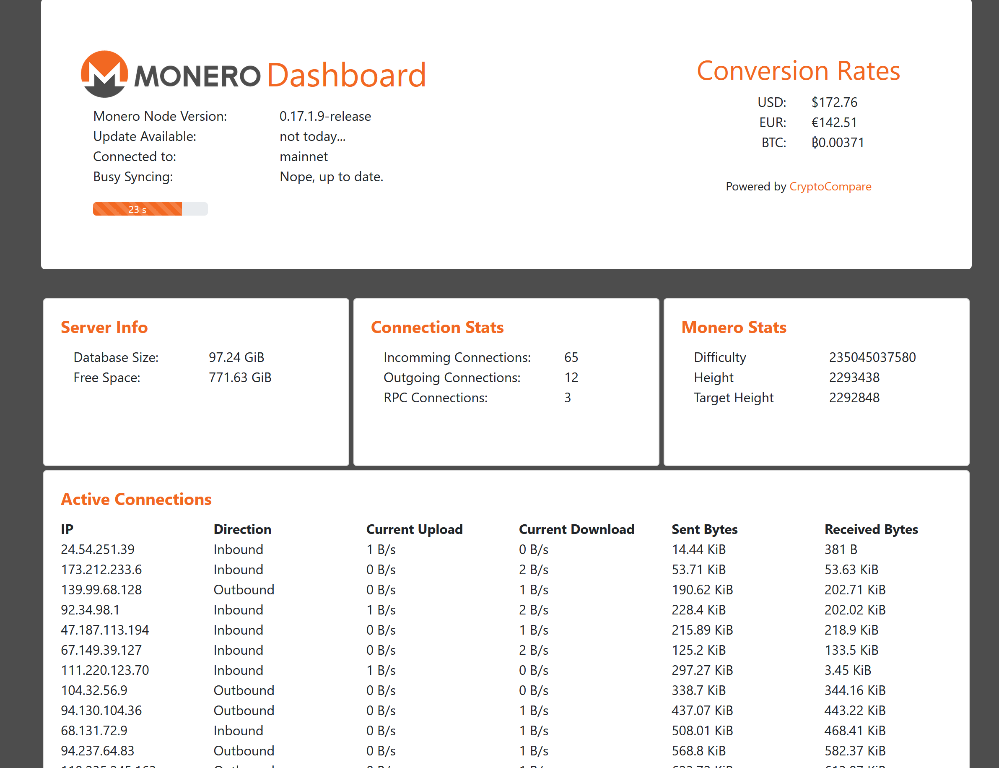

# monero-dashboard

The Monero Dashboard was designed to be a nicely formatted viewport into your local Monero node.


# Getting Started

The dashboard is a node application that runs on port `3000` and connects to a full node running at `localhost:18081`. These defaults can be changed by creating a `.env` file (copied from`sample.env`).

**.env**

```
MONERO_HOST=10.1.1.1
MONERO_PORT=18081
```

That said, the host machine will need to have `node` and `npm` installed.

To Start the dashboard, run `npm start`

# Contributing

Please feel free to either submit issues for improvements, or fork the repo and make pull requests.

To get started, run the following commands:

```
npm run init
npm npm dev
```

This will start the api server on port `3000`, and the react server on `3001`. Do your testing/dev against `localhost:3001`

Prettier and eslint will keep your code in line with the coding standards for the project.
